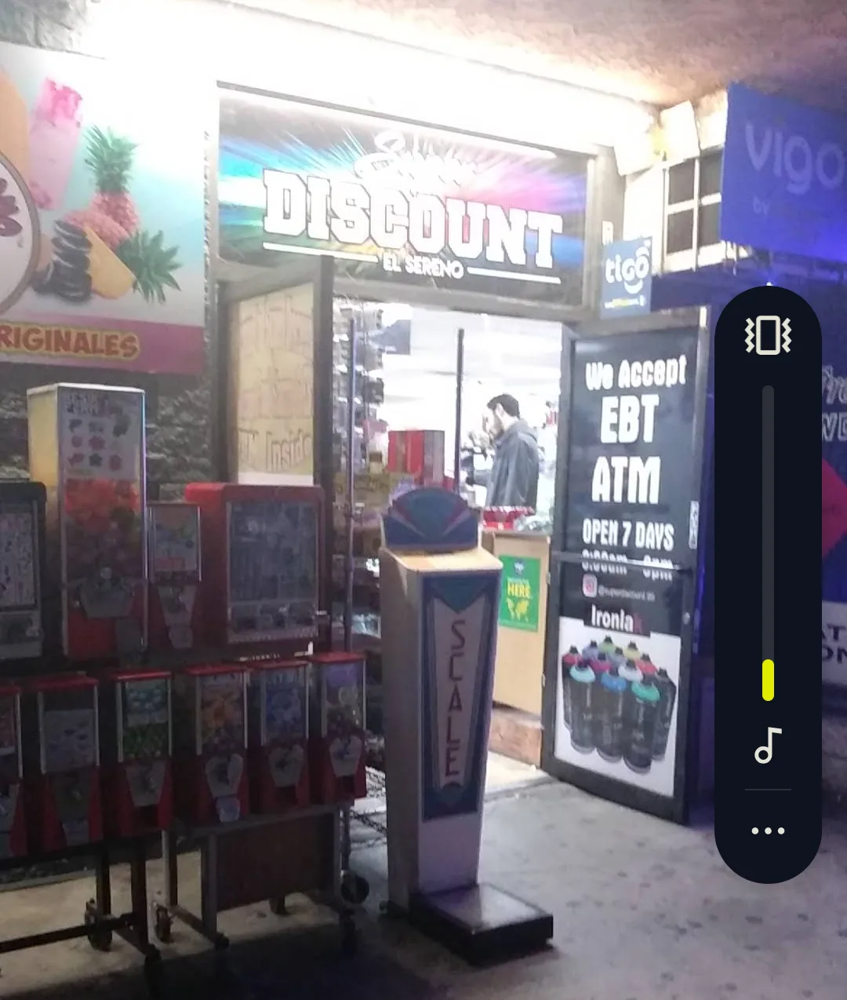

# Super Discount El Sereno — Website Improvement Plan

**Site:** https://epicsereno.github.io/superdiscount/  
**Evaluated:** May 2026  
**Overall Grade:** B−  
**Priority:** Align visual identity with brand voice; close the gap between "loud neighborhood store" copy and "minimal startup" aesthetics.

---

## Table of Contents

1. [Critical Fixes](#1-critical-fixes)
2. [Visual Identity](#2-visual-identity)
3. [Typography](#3-typography)
4. [Layout & Structure](#4-layout--structure)
5. [Performance](#5-performance)
6. [SEO & Accessibility](#6-seo--accessibility)
7. [Brand Strategy](#7-brand-strategy)
8. [Quick Wins Checklist](#8-quick-wins-checklist)

---

## 1. Critical Fixes

### 1.1 Replace Icon Glyphs in Services Section

**Problem:** The service card headers use `$`, `*`, `+`, `#` as placeholder icons. These read as unfinished and are not screen-reader meaningful.

**Fix Options (pick one):**

| Option | Description | Effort |
|---|---|---|
| SVG Icons | Use Heroicons, Phosphor, or custom SVGs per category | Low |
| Numbered System | Replace with `01`, `02`, `03`, `04` in bold display type | Low |
| Emoji (budget) | 🎉 🧹 💳 🔄 — fast, culturally readable for the audience | Minimal |

**Recommended:** Numbered system — extends the `Super/Discount` typographic motif and looks intentional.

```html
<!-- Before -->
<h3>$</h3>

<!-- After -->
<span class="card-number">01</span>
<h3>Everyday Essentials</h3>
```

---

### 1.2 Merge Contact + Location Sections

**Problem:** Both sections display the same address and phone number. This creates redundancy and pads the page with no added value.

**Fix:** Consolidate into a single **"Find Us"** section with:
- Embedded map (keep existing)
- Address + hours
- Single phone CTA
- Optional: "Call ahead for rentals" note inline, not as a separate section header

---

### 1.3 Hero Image Fallback

**Problem:** Three images load in the hero (`sign.png`, `storefront.png`, `frontdoor.png`). If any are slow or fail, the hero has no fallback visual system.

**Fix:** Add a CSS background color that matches the store's brand palette as a fallback behind each ``:

```css
.hero-image-wrapper {
  background-color: #D72B2B; /* Store red — see Brand Color below */
}
```

---

## 2. Visual Identity

### 2.1 Introduce Brand Color

**Problem:** The site is tonally flat. The store's own signage uses high-energy red and yellow, but the website uses no color outside of black/white/photo.

**Recommended Palette:**

| Role | Color | Hex | Usage |
|---|---|---|---|
| Primary | Signage Red | `#D72B2B` | CTA buttons, section accents, hover states |
| Secondary | Market Yellow | `#F5C518` | Highlights, badge elements, service card borders |
| Base Dark | Near-Black | `#1A1A1A` | Body text, nav |
| Base Light | Off-White | `#F9F6F0` | Section backgrounds (warmer than pure white) |

**Where to apply immediately:**
- CTA buttons (`Call` + `Get Directions`) → Red fill, white text
- Section dividers or left-border accents on service cards → Yellow
- Nav `Discount` bold text → Red

```css
:root {
  --color-primary: #D72B2B;
  --color-secondary: #F5C518;
  --color-dark: #1A1A1A;
  --color-light: #F9F6F0;
}

.btn-primary {
  background: var(--color-primary);
  color: white;
}
```

---

### 2.2 Extend the Super/Discount Typographic Motif

**Problem:** The `Super` (light) / **`Discount`** (bold) contrast in the nav is the strongest branding moment on the site — but it appears nowhere else.

**Fix:** Use this weight-contrast pattern as a design system throughout:

```
// Section labels
"Dense Aisles,  LOUD SIGNS"
"Open  DAILY"
"EBT  ACCEPTED"
```

Apply consistently: light weight word + bold word = brand rhythm.

---

## 3. Typography

### 3.1 Current State
- Clean and readable — no critical errors
- Font choice appears to be a system/default stack — defensible but forgettable

### 3.2 Recommended Upgrade

Pair a **display font** with a **utility body font** that matches the neighborhood store energy:

| Role | Font | Source | Why |
|---|---|---|---|
| Display / Headlines | **Bebas Neue** | Google Fonts | Bold, compressed — matches storefront sign energy |
| Body | **DM Sans** | Google Fonts | Clean, modern, high legibility on mobile |

```html
<link href="https://fonts.googleapis.com/css2?family=Bebas+Neue&family=DM+Sans:wght@400;500;700&display=swap" rel="stylesheet">
```

```css
h1, h2, h3 { font-family: 'Bebas Neue', sans-serif; letter-spacing: 0.05em; }
body        { font-family: 'DM Sans', sans-serif; }
```

---

## 4. Layout & Structure

### 4.1 Section Rhythm

**Problem:** All sections use identical vertical padding and white backgrounds — no rhythm, no visual breathing room or contrast between zones.

**Fix:** Alternate section backgrounds to create cadence:

```
Hero          → Photo-driven, dark overlay
Services      → Off-white (#F9F6F0)
About         → Red (#D72B2B), white text  ← "loud" section
Location      → Dark (#1A1A1A), white text
```

### 4.2 Service Cards

**Problem:** Cards are text-only with placeholder glyphs. No visual weight differentiation.

**Improvement:**
- Add a left yellow border accent (`border-left: 4px solid var(--color-secondary)`)
- Use numbered system (01–04) in large display type as background watermark
- Slight card lift on hover (`box-shadow`, `transform: translateY(-2px)`)

```css
.service-card {
  border-left: 4px solid var(--color-secondary);
  transition: transform 0.2s ease, box-shadow 0.2s ease;
}
.service-card:hover {
  transform: translateY(-2px);
  box-shadow: 0 8px 24px rgba(0,0,0,0.08);
}
```

### 4.3 About Section

**Strength:** Best written section. Keep the copy as-is.  
**Improvement:** Pull one line out as a large pull-quote in Bebas Neue display type:

> *"The windows do the talking."*

This becomes an anchor visual moment in the section.

---

## 5. Performance

### 5.1 Image Optimization

| Image | Issue | Fix |
|---|---|---|
| `storefront.png` | PNG likely oversized | Convert to `.webp`, compress to <150KB |
| `sign.png` | Appears twice in markup | Load once, reuse via CSS or single `` |
| `frontdoor.png` | Below fold | Add `loading="lazy"` |

```html
<!-- Lazy load below-fold images -->

```

### 5.2 Render-Blocking Resources

- If adding Google Fonts: use `display=swap` (already shown above) to prevent FOIT (Flash of Invisible Text)
- Defer any non-critical JS

---

## 6. SEO & Accessibility

### 6.1 What's Already Good ✅
- Meta description set and descriptive
- OG image defined
- Title tag includes location + category
- All `` tags have `alt` text

### 6.2 Improvements Needed

| Issue | Fix |
|---|---|
| Icon glyphs `$`, `*`, `+`, `#` not meaningful to screen readers | Replace with text or add `aria-label` |
| No structured data (Schema.org) | Add `LocalBusiness` JSON-LD (see below) |
| Phone number not marked up | Wrap in `<a href="tel:+13232238115">` (already done — verify on mobile) |

**Schema.org JSON-LD (add to `<head>`):**

```html
<script type="application/ld+json">
{
  "@context": "https://schema.org",
  "@type": "Store",
  "name": "Super Discount El Sereno",
  "address": {
    "@type": "PostalAddress",
    "streetAddress": "3118 N Eastern Ave",
    "addressLocality": "Los Angeles",
    "addressRegion": "CA",
    "postalCode": "90032"
  },
  "telephone": "+13232238115",
  "openingHours": "Mo-Su 09:30-21:00",
  "paymentAccepted": "Cash, EBT/SNAP"
}
</script>
```

---

## 7. Brand Strategy

### 7.1 The Core Problem

The site **describes** chaos but **presents** calm. The copy uses words like *"loud signs," "dense aisles," "unpolished"* — but the design is clean, quiet, and minimal. These two things are speaking different dialects.

**This is not a call to make the site ugly.** It's a call to make it *feel* like the store.

### 7.2 The Fix: Controlled Energy

The goal is **"organized loudness"** — structured like a modern site, energetic like the store.

| Design Choice | Calm (Current) | Energetic (Target) |
|---|---|---|
| CTA buttons | Likely outlined/minimal | Red fill, bold label |
| Section headers | Default weight | Bebas Neue, uppercase |
| Color palette | Black/white/photo | + Red + Yellow accents |
| Service cards | Plain text blocks | Left accent, hover lift |
| About section | Paragraph copy | Pull-quote breakout |

### 7.3 Competitive Positioning

Super Discount doesn't need to look like Amazon or Target. It needs to look like **the most trustworthy, professional version of itself.** The site should say: *"We're the real deal, we've been here, and we're not going anywhere."*

That is achieved through consistency, not minimalism.

---

## 8. Quick Wins Checklist

Copy-paste this as a task list:

```markdown
## Super Discount — Fix Tracker

### 🔴 High Priority (Do First)
- [ ] Replace $, *, +, # glyphs with numbered system (01–04) or SVG icons
- [ ] Merge Contact + Location into single "Find Us" section
- [ ] Apply brand red (#D72B2B) to CTA buttons
- [ ] Convert images to .webp format
- [ ] Add loading="lazy" to frontdoor image

### 🟡 Medium Priority (This Week)
- [ ] Add yellow left-border accent to service cards
- [ ] Install Bebas Neue for display headings
- [ ] Alternate section background colors for rhythm
- [ ] Add Schema.org LocalBusiness JSON-LD to <head>

### 🟢 Low Priority (Nice to Have)
- [ ] Extend Super/Discount weight-contrast motif to section labels
- [ ] Add pull-quote breakout to About section
- [ ] Add card hover states (translateY + box-shadow)
- [ ] Add image fallback background-color to hero wrappers
```

---

*Evaluation by Claude — Senior Creative Director & Lead Prompt Engineer*  
*Super Discount El Sereno | epicsereno.github.io/superdiscount*
